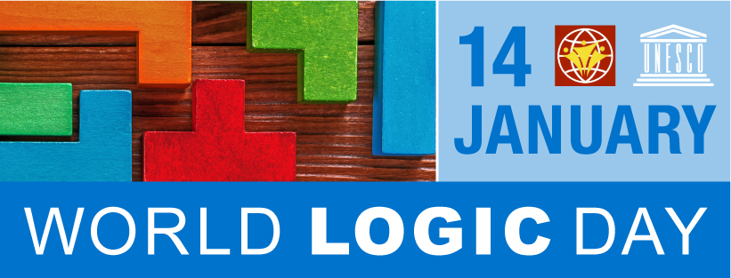

# World Logic Day 2023
## January 13--14 2023, Zagreb, Croatia

  ++općeniti tekst o svjetskom danu logike++ 

  ++neki tekst++. The conference will take place at the Faculty of Science--Department of Mathematics, University of Zagreb. Talks will be held in person, while online participation will be available for listeners only. Each talk will be allocate 45 minutes for presentation and 15 minutes for discussion.

  
  

  <b>Important dates</b>
   
  Registration and submission deadline: December 27th
   
  Author notification: January 1st
   
  Programme: January 2nd

<b>Registration:</b>
 
No registration fee.

<b>Submission</b>
 
Authors should send an abstract to tin.adlesic@ufzg.hr with subject WLD2023 ZAGREB.
 
Online participants should register via mail to the same address with the same subject.

<b>Venue</b>
 
<a href="https://www.pmf.unizg.hr/math/en">Universty of Zagreb-Department of Mathematics</a>,
<a href="https://www.google.com/maps/place/Faculty+of+Science+-+Department+of+Mathematics/@45.8269932,15.9854367,18.25z/data=!4m5!3m4!1s0x4765d70eb94a8233:0x19534949a4612a83!8m2!3d45.8268954!4d15.9855294">map</a>

<b>Organizers</b>
 
Tin Adlešić, tin.adlesic@ufzg.hr
 
Vedran Čačić, veky@math.hr

